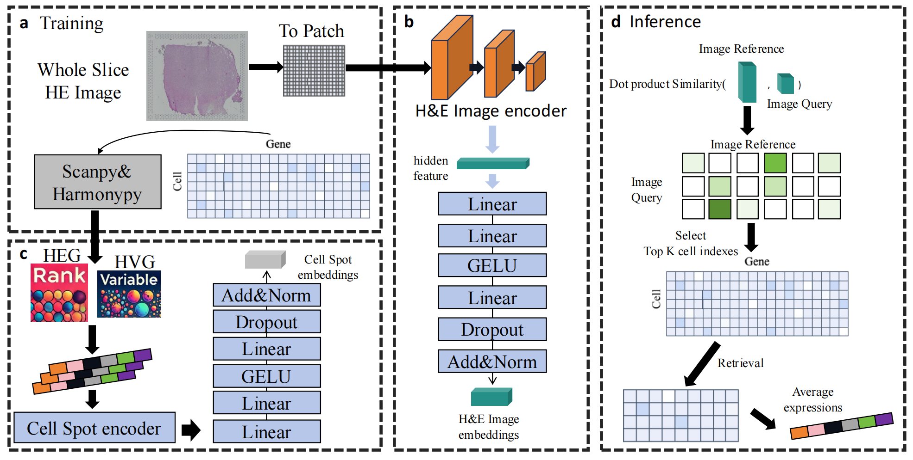

# HECLIP

This code is prepared for **"HECLIP: An Advanced CLIP-based model for Gene Expression Prediction from Histology Images"**.

## Overview

### Abstract
HECLIP is an innovative CLIP-based model designed to predict gene expression directly from histological images, addressing the challenges of accuracy and complexity faced by traditional methods. Histological images play a crucial role in medical diagnosis and research, but matching them with corresponding gene expression profiles is often time-consuming and costly. While various machine learning approaches have been proposed to tackle this issue, they often struggle with accuracy and involve complex workflows, limiting their effectiveness in predicting gene expression from image data. HECLIP leverages contrastive learning and single-modality-centric loss functions to optimize the image encoder, enhancing the predictive power of the image modality while reducing reliance on the gene modality. Unlike traditional methods, HECLIP employs image-based data augmentation strategies and achieves state-of-the-art performance across multiple benchmarks. Evaluations on four public dataset demonstrate HECLIP's superior performance in predicting highly expressed genes, achieving high correlation, hit rates, and stable cross-cell predictions. Our code are available at https://github.com/QSong-github/HECLIP.





# Directory Structure


```plaintext
HECLIP-main/
├── README.md
├── he_00.png
├── environment.yaml
├── code/
    ├── ebd/
        ├── GSE240429/
            ├── heg/
            └── hvg/
        ├── GSE245620/
        ├── spatialLIBD_1/
        └── spatialLIBD_2/
    ├── figure/
        ├── EBD/
        └── EXP/
    ├── save/
        ├── GSE240429/
            ├── hvg_best.pt
            └── heg_best.pt
        ├── GSE245620/
        ├── spatialLIBD_1/
        └── spatialLIBD_2/
    ├── main.py
    ├── utils.py
    ├── infer.py
    └── ...
├── GSE240429/
    ├── data/
        ├── filtered_expression_matrices/
            ├── 1/
                ├── barcodes.tsv
                ├── features.tsv
                ├── matrix.mtx
                └── ...
            ├── 2/
            └── ...
        └── tissue_pos_matrices/
            ├── tissue_positions_list_1.csv
            ├── tissue_positions_list_2.csv
            └── ...
    └── image/
        ├── GEX_C73_A1_Merged.tiff
        └── ...
├── GSE245620/
    ├── data/
    └── image/
└── GSE/
    ├── spatialLIBD_1/
        ├── data/
        └── image/
    └── spatialLIBD_2/
        ├── data/
        └── image/
```


## Installation
Download HECLIP:
```git clone https://github.com/QSong-github/HECLIP```

Install Environment:
```conda env create -f environment.yaml```


## Running

### Prepare data.

   
   (1) download the data.
       * [GSE240429](https://www.ncbi.nlm.nih.gov/geo/query/acc.cgi?acc=GSE240429)
       * [GSE245620](https://www.ncbi.nlm.nih.gov/geo/query/acc.cgi?acc=GSE245620)
       * [spatialLIBD_1](https://research.libd.org/spatialLIBD/)
       * [spatialLIBD_2](https://research.libd.org/spatialLIBD/)

   Note: For spatialLIBD_1 and spatialLIBD_2, it is necessary to run std.py to convert the h5 to mtx format.


   (2) preprocess the data.
   ```bash
   $ cd /path/to/code
   $ python preprocess_GSE240429.py
   $ python preprocess_GSE245620.py
   $ python preprocess_spatialLIBD_1.py
   $ python preprocess_spatialLIBD_2.py
   ```
### Train the HECLIP.

   (3) Train the model.
   ```bash
   $ cd /path/to/main.py
   $ python main.py
   ```
   
### Inference   

   (4) Inference.
   ```bash
   $ cd /path/to/infer.py
   $ python infer.py
   ```


## Quick start

If you want to skip the training, you can download the pre-trained HECLIP model from [here](https://drive.google.com/file/d/1q1MYoICLeY7w30CuT2eBxGw0kiHESMgK/view?usp=drive_link) and quickly try it by the 'infer.py.'
   
